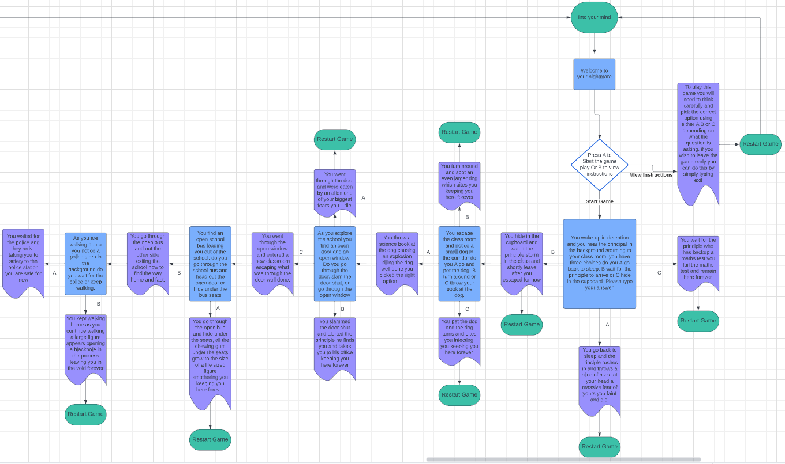
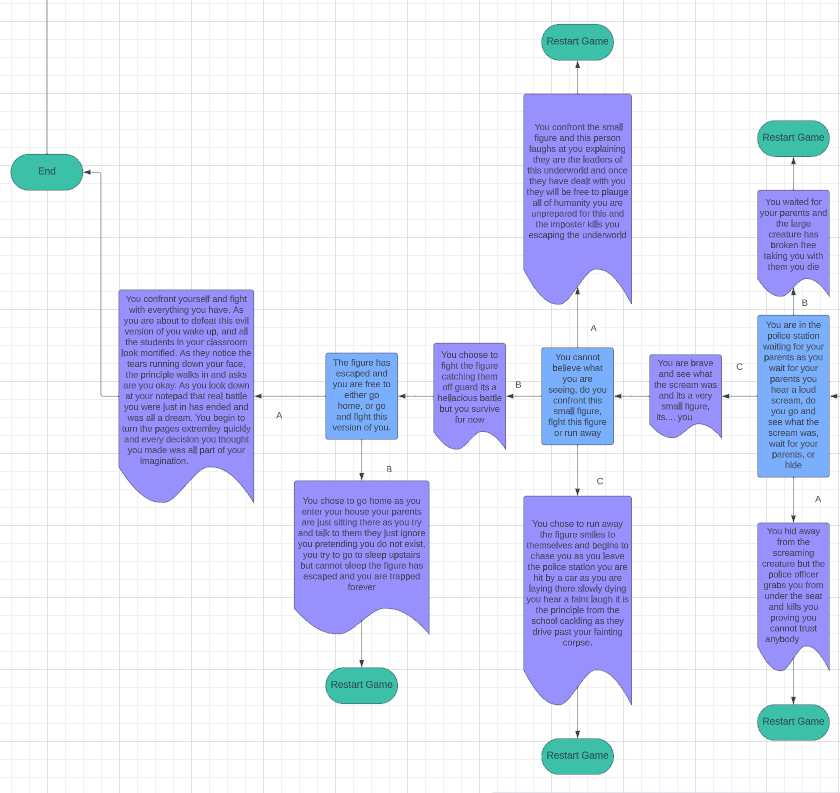
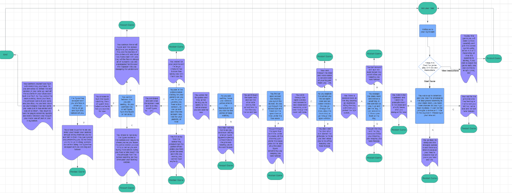

# Into Your Mind

Welcome to Into Your Mind this app was created with Python and deployed with Heroku. This game was designed to lead players through the madness option text based game called into your mind, this game will have different options allowing the player to decide where they would like to go next, but pick carefully as picking the wrong option can result in game over.

## CONTENTS

## Project Goals

### User Stories 

* I would like to view the instructions to understand how to play the game.
* I would like to be able to enter my own name to create my own character.
* I would like to be able to make clear decisions that have an impact on the game.
* I would like my decisions to have importance with clear descriptions on what happens next.
* I would like to restart or exit the game at any point if I was to make a wrong decision.
* I Would like to return to the main menu at any time to view any further instructions I may have missed.
* I like story driven text based adventures which have a clear explanation on the world and its surroundings. 

## Flow Chart 

This is how into your mind will work each decision the user makes will lead to a specific senario whether that is viewing the instructions or just progressing in the game each decision the user makes has an outcome. This flow chart has allowed me to outline the logic I am looking to follow which means during production there will be no logic gaps and everything will work as I intended.

## Key Features

### Welcome Message

* This element will allow users to enter there first name. Which allows them to create there own character, making the experience more personalised for themselves.

## Languages 

## Frameworks & Tools 

## Deployment 

### How to deploy 

### How to fork

### How to clone

## Testing 

### Solved Bugs

* Fixed a bug where the while loop at the beginning continued to loop or was only printing the valid statement once with the break keyword. In order to fix this I used the try and except methods in the while loop, which checked to see if the conditions were met. If they were the code would run, unless there was a value error which would then  print out the else statement. Asking the user to use the correct format the loop would keep running until the else statement was met.
* Fixed a bug where the user couldn't enter a lowercase value. In order to fix this I added the .upper method to the start variable, which converted each string input to an uppercase value which passed the if validation fixing this issue.
* Fixed a bug where username was not defined and could not be accessed in other functions apart from the welcome message function where the username variable was declared. To fix this I added the username paramater for every function other than the welcome message function, which allowed me to access the username variable in other functions.
* Fixed a bug where the first selection would keep repeating when the answer was correct. In order to fix this I added the continue keyword to the else statement which fixed this issue.
* Fixed a bug where the output delay was repeating removed the output delay from the while true statement and adjusted the format of the text message to improve readability for the user.
* Fixed a bug where the abandoned bus kept repeating to fix this, I added the break keyword to the if statements if that specific condition was met. Whereas I added the continue keyword to the else statement to stop the loop running.
* After validation I noticed many bugs where the letter count had exceeded the maximum allowance and there were many white spaces which were being shown as errors. In order to fix this, I changed the formatting for the whole run.py document. Which involved removing extra white spaces, making sure the letter count was not exceeding the maximum allowance. While also adding in extra spaces, to ensure there was enough spaces between functions, doing all of this fixed these issues, with the code passing the validation checker with no bugs.
* Adjusted senario selection bugs where the user would enter an input and the wrong senario was being showcased in order to fix this I made some changes to the text message senario making sure the correct senarios were being shown.
* Fixed a bug where figure choice c was being reassigned before being defined in the small figure function in order to fix this I removed one equals sign which fixed this issue.

## Credits 

### Media 

#### Code

#### Content 

#### Acknowledgements