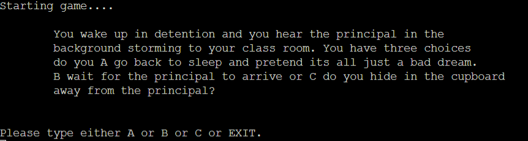
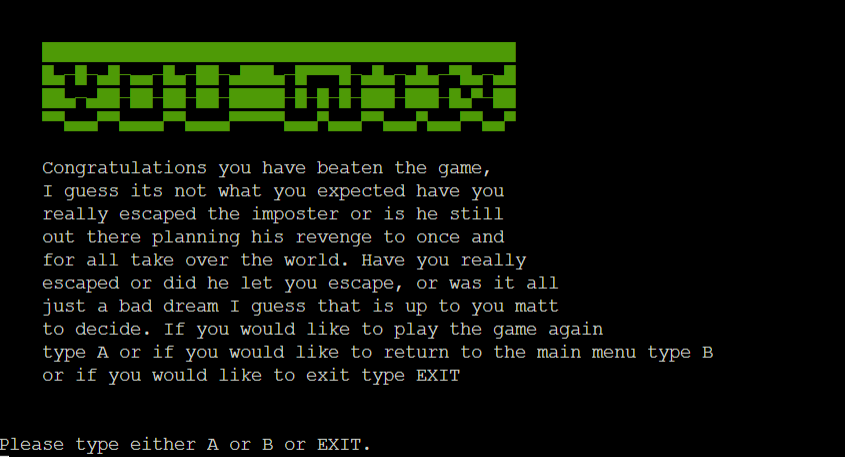

# Into Your Mind

Welcome to Into Your Mind this app was created with Python and deployed with Heroku. This game was designed to lead players through the madness option text based game called into your mind, this game will have different options allowing the player to decide where they would like to go next, but pick carefully as picking the wrong option can result in game over.

## CONTENTS

- [Into Your Mind](#into-your-mind)
    - [CONTENTS](#contents)
    - [Project Goals](#project-goals)
        - [Client Goals](#client-goals)
        - [User Goals](#user-goals)
        - [Frequent User Goals](#frequent-user-goals)
        - [Future Implementations](#future-implementations)
    - [Design](#design)
        -[Flow Chart](#flow-chart)
    - [Key Features](#key-features)
        - [Welcome Message](#welcome-message)
        - [Wrong Format Welcome Message](#wrong-format-welcome-message)
        - [Intro Message](#intro-message)
        - [Instructions](#instructions)
        - [Different Scenarios](#different-scenarios)
        - [Correct Answers](#correct-answers)
        - [Wrong Answers](#wrong-answers)
        - [Game Over Screen](#game-over-screen)
        - [Exit Screen](#exit-screen)
        - [Wrong Format](#wrong-format)
        - [Congratulations screen](#congratulations-screen)
    - [Languages](#languages)
    - [Frameworks and tools](#frameworks--tools)
    - [Deployment](#deployment)
        - [How to deploy](#how-to-deploy)
        - [How to fork](#how-to-fork)
        - [How to deploy on heroku](#how-to-clone)
    - [Credits]
        - [Media](#media)
        - [Code](#code)
        - [Content](#content)
        - [Acknowledgements](#acknowledgements)

## Project Goals

### Client Goals

* I would like to view the instructions to understand how to play the game.
* I would like to be able to enter my own name to create my own character.
* I would like to be able to make clear decisions that have an impact on the game.
* I would like my decisions to have importance with clear descriptions on what happens next.
* I would like to restart or exit the game at any point if I was to make a wrong decision.
* I Would like to return to the main menu at any time to view any further instructions I may have missed.
* I like story driven text based adventures which have a clear explanation on the world and its surroundings.

### User Goals

### Frequent user goals

### Future Implementations

## Design

### Flow Chart 

This is how into your mind will work each decision the user makes will lead to a specific senario whether that is viewing the instructions or just progressing in the game each decision the user makes has an outcome. This flow chart has allowed me to outline the logic I am looking to follow which means during production there will be no logic gaps and everything will work as I intended.

## Key Features

### Welcome Message

* This element will allow users to enter there first name. Which allows them to create there own character, making the experience more personalised for themselves.

### Wrong format Welcome Message

* This will be shown if the user doesn't enter anything. An error message will appear asking the user to enter there name.

### Intro Message 

* This intro message will greet the user with the name they entered. After this the intro message will continue allowing the user to either enter A to start the game or B to view the instructions, allowing the user to take there time before starting the game.

### Instructions

* This element will teach the user how  to play the game informing them the rules of the game, teaching them about how to answer the different scenarios that are presented to the user. The instructions will also contain valuable information for the user such as informing the user they are able to leave the game at any time by typing exit. This will all be showcased in the instructions element, making sure the user does not get frustrated and understands the game before starting.

### Different Scenarios 

* This element is the different scenarios that will appear depending on where the user finds themsevles in the game. Different Scenarios will have different requirements where some will have three options, whereas others will have two. For each scenario there will be only one correct answer meaning the wrong answer will mean game over, teaching the user to think carefully before confirming there answer. Down below are three different scenarios at different points in the game showing the user what they could expect when playing Into Your Mind.

### Correct Answers 

* This element will show the result of answering a scenario correctly moving onto the next stage of the game.

### Wrong Answers

* This element will show the result of answering a scenario loading the game over screen for the user informing them that the answer is incorrect and to try again.

### Game Over Screen

* This element will be shown to the user when the user gets an answer wrong, with the message you died being shown. After this message appears there will also be a message informing the user to either type A to restart the game and try again. The user can also type B to go back to the Main Menu. The user could also type exit to exit the application altogether. After exiting the application the user can click run program to restart the application from the beginning starting from scratch.

### Exit screen 

* This element will be shown if at any point the user types in EXIT. To ensure errors do not occur I have also used the .upper method to make sure errors do not occur if the user enters exit in lowercase rather than in uppercase. The exit message will thank the user for playing the game while also exiting the application altogether. If the user would like to restart the application they can simply click the run program button.

### Wrong Format 

* This element will be shown if the user does not enter either A or B or C or even exit depending on the different scenario. If the user was to enter a number this error message would be shown. If A or B or C or exit have not been entered this same error message will appear. This will give the user clear visual feedback in what they need to do, removing any unneccesary frustration the user may have had, if this was not outlined clearly.

### Congratulations screen

* This element will be shown if the user has answered every scenario correctly. This screen will inform the user of there success providing further key story information, they would have not recieved unless they had completed the game. Upon completetion the user will be asked to type either A to play again or to type EXIT to exit the applicaton altogether.

## Languages 

* Python

## Frameworks & Tools 

- [Git Hub](https://github.com/)
- [Git](https://git-scm.com/)
- [Code Anywhere](https://codeanywhere.com/solutions/collaborate)
- [Fsy symbols](https://fsymbols.com/text-art/)
- [Heroku](https://www.heroku.com/)
- [Python Validator](https://pep8ci.herokuapp.com/#)

## Deployment 

### How to deploy 

### How to fork

### How to deploy on heroku

## Credits 

### Media 

#### Code

#### Content 

#### Acknowledgements