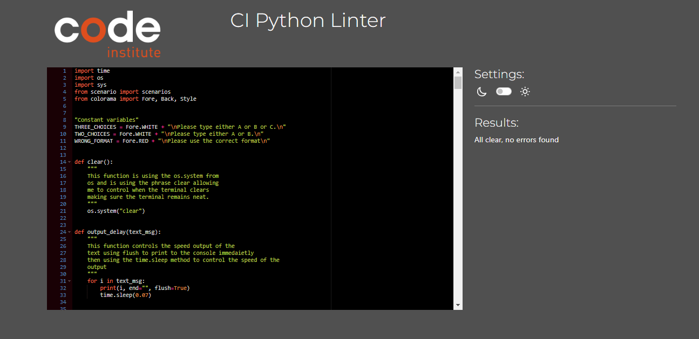

# Into Your Mind Testing

Welcome to the testing results of the text based action adventure game known as Into Your Mind in this document you will find all the testing results, such as solved bugs and how they were fixed, also the manual testing and how each element was tested making sure each element was working as intended.

## CONTENTS

- [Into Your Mind Testing](#into-your-mind-testing)
    - [Contents](#contents)
    - [Testing Content](#testing-content)
        - [Python Validation](#python-validation)
        - [Solved Bugs](#solved-bugs)
        - [Known Bugs](#known-bugs)
        - [Manual Testing](#manual-testing)
            - [Aims](#aims)
            - [Testing Steps](#testing-steps)
        - [Testing Results](#testing-results)

## Testing Content

## Python Validation

### Solved Bugs

* Fixed a bug where the while loop at the beginning continued to loop or was only printing the valid statement once with the break keyword. In order to fix this I used the try and except methods in the while loop, which checked to see if the conditions were met. If they were the code would run, unless there was a value error which would then  print out the else statement. Asking the user to use the correct format the loop would keep running until the else statement was met.
* Fixed a bug where the user couldn't enter a lowercase value. In order to fix this I added the .upper method to the start variable, which converted each string input to an uppercase value which passed the if validation fixing this issue.
* Fixed a bug where username was not defined and could not be accessed in other functions apart from the welcome message function where the username variable was declared. To fix this I added the username paramater for every function other than the welcome message function, which allowed me to access the username variable in other functions.
* Fixed a bug where the first selection would keep repeating when the answer was correct. In order to fix this I added the continue keyword to the else statement which fixed this issue.
* Fixed a bug where the output delay was repeating removed the output delay from the while true statement and adjusted the format of the text message to improve readability for the user.
* Fixed a bug where the abandoned bus kept repeating to fix this, I added the break keyword to the if statements if that specific condition was met. Whereas I added the continue keyword to the else statement to stop the loop running.
* After validation I noticed many bugs where the letter count had exceeded the maximum allowance and there were many white spaces which were being shown as errors. In order to fix this, I changed the formatting for the whole run.py document. Which involved removing extra white spaces, making sure the letter count was not exceeding the maximum allowance. While also adding in extra spaces, to ensure there was enough spaces between functions, doing all of this fixed these issues, with the code passing the validation checker with no bugs.
* Adjusted senario selection bugs where the user would enter an input and the wrong senario was being showcased in order to fix this I made some changes to the text message senario making sure the correct senarios were being shown.
* Fixed a bug where figure choice c was being reassigned before being defined in the small figure function in order to fix this I removed one equals sign which fixed this issue.
* Fixed exit bug by adding in the paramater username for all functions.
* Fixed game over bugs by adjusting the speed of the load game over function to improve readability for the user.
* Fixed a bug where the user could input numbers or special characters into the name field. To fix this I used the or not operator and the isalpha method to make sure the input being entered is a string and not a float, int or any special characters which fixed this issue.
* Fixed scenario bugs when trying to import the dictionary, an error appeared stating that none is not an object. In order to access the nested dictionary I first used the get method to get the dictionary scenarios. Then used the brackets to get the nested object scenario one and then square brackets to get the child. Which fixed these bugs, allowed me to access the nested dictionary.
* Fixed win message but, the text imported was much bigger than the terminal, to fix this I changed the image to fit the terminal which fixed this issue.
* Fixed three choices bug by creating the first choice variable and assigning this the constant variable called three choices orginally only the else statement was printing to use a valid format but assigning the first choice variable to the constant variable three choices fixed this issue.
* Fixed colorama errors as when I changed the font to red, the rest of the text would remain red. In order to fix this I changed the font back to white for all scenarios and loading outputs.
* Fixed colorama errors on deployed heroku application. In order to fix this I updated the requirements.txt file using the pip3 freeze > requirements.txt method which fixed this issue.
* Fixed Class bugs by defining username as an empty string and then passing this new variable into the introduction file. When I needed to use the class I created a variable called p1 which stands for player one. This allowed me to have multiple characters if I needed to. To use the variable p1 I also used dot notation to get the function introduction which fixed these issues.

### Known bugs

* Was many bugs for the timer tried using multiprocessing and threading to run two loops coccurently. However there were to many issues so this was removed from the final project.
* No other known bugs.

### Manual Testing

#### Aims

* The aim is to make sure all elements work as intended without any console bugs, these bugs will be any invalid input such as enterting numbers, random letters or special characters are all bugs I am looking to avoid.
* This will be done by making sure all if else statements work as intended and have the desired outcome.
* Make sure the user can enter there first name, with this being tracked, if the user enters the wrong input an error message is shown informing the user what is wrong.
* The user is able to complete the game.
* The user is able to exit the application at any point.

#### Testing Steps

* I will first make sure all scenarios can be answered correctly leading to the expected outcome. While making sure the game can be completed.
* Next I will make sure that the user can not enter the wrong input. If the user does an error message should appear stating what to do next.
* After this I will make sure if the user answers the scenario incorrectly, the game should load the game over screen.
* Once this has been completed I will make sure the text has the correct colour such as errors being in red, the winning screen in green and normal text in white, making sure the colours work as intended and for example do not stay red after an error message.
* This testing will completed using the deployed heroku application with all testing recorded in the tables below.

### Testing Results

`Intro screen` 

**Element**|**Expected Outcome**|**Testing Performed**|**Result**|**Pass/Fail**
:-----:|:-----:|:-----:|:-----:|:-----:
Intro Message|Intro message to show when program runs|Run Program|Intro message shown|Pass
Intro Message (input = none)|Please enter your name to appear|Pressed enter|Please enter your name shown|Pass
Intro Message (numbers)|Please enter your name with alphabet letters|Entered Numbers|Please enter your name with alphabet letters shown|Pass
Intro Message (Negative numbers)|Please enter your name with alphabet letters|Entered Negative numbers|Please enter your name with alphabet letters shown|Pass
Intro Message (Special characters)|Please enter your name with alphabet letters|Entered Special characters|Please enter your name with alphabet letters shown|Pass
Intro Message (completed)|Welcome message to appear|Entered name|Welcome Message appeared|Pass
Welcome message (none)|Please enter a valid format please type either a or b|Pressed enter|Please enter a valid format please type either a or b shown|Pass
Welcome message (numbers)|Please enter a valid format please type either a or b|Entered Numbers|Please enter a valid format please type either a or b shown|Pass
Welcome message (negative numbers)|Please enter a valid format please type either a or b|Entered Negative numbers|Please enter a valid format please type either a or b shown|Pass
Welcome message (special characters)|Please enter a valid format please type either a or b|Entered Special characters|Please enter a valid format please type either a or b shown|Pass
Welcome Message (A)|Game to start with first senario|Typed A|Game started with first senario|Pass
Welcome Message (B)|Instructions to load informing user how to play|Typed B|Instructions loaded|Pass
Instructions(none)|Please enter either A or B loaded|Entered nothing|Please enter either A or B loaded|Pass
Instructions(Negative Numbers)|Please enter either A or B loaded|Entered negative numbers|Please enter either A or B loaded|Pass
Instructions (Numbers)|Please enter either A or B loaded|Entered  numbers|Please enter either A or B loaded|Pass
Instructions(Special Characters)|Please enter either A or B loaded|Entered Special characters|Please enter either A or B loaded|Pass
Instructions(A)|Game to start with first senario|Typed A|Game started with first scenario|Pass
Instructions(B)|Main menu to load|Typed B|Main Menu Loaded|Pass
Instructions(Exit)|Message to thank the user for playing, to exit application|Typed Exit|Message to thank the user for playing, to exit application shown|Pass

`First Scenario`

**Element**|**Expected Outcome**|**Testing Performed**|**Result**|**Pass/Fail**
:-----:|:-----:|:-----:|:-----:|:-----:
First Scenario|Scenario to load when start game is launched|Launched game|First Scenario shown|Pass
First choice(none)|Please enter the correct format either A or B or C to load|Entered nothing|Please enter the correct format either A or B or C shown|Pass
First choice(negative numbers)|Please enter the correct format either A or B or C to load|Entered Negative numbers|Please enter the correct format either A or B or C shown|Pass
First choice(numbers)|Please enter the correct format either A or B or C to load|Entered Numbers|Please enter the correct format either A or B or C shown|Pass
First choice(special characters)|Please enter the correct format either A or B or C to load|Entered Special characters|Please enter the correct format either A or B or C shown|Pass
First choice(characters other than A or B or C)|Please enter the correct format either A or B or C to load|Entered other characters|Please enter the correct format either A or B or C shown|Pass
First Choice (A)|Wrong option message loaded leading to game over screen|Entered A|Wrong option message loaded leading to game over screen shown|Pass
First Choice(B)|Wrong option message loaded leading to game over screen|Entered B|Wrong option message loaded leading to game over screen shown|Pass
First Choice (C)|Correct option message loaded leading to escaped classroom scenario|Entered C|Correct option message loaded leading to escaped classroom scenario shown|Pass
First Choice (EXIT)|Message to thank the user for playing, to exit application|Typed Exit|Message to thank the user for playing, to exit application shown|Pass
You died text|You died text to load when user selects wrong option|Entered wrong option|You died text loaded|Pass
Game over choice|Please try again message to appear after you died text|Waited for you died text|Please try again message appeared|Pass
Game over choice(none)|Please enter A or B or Exit to appear|Entered nothing|Please enter A or B or Exit shown|Pass
Game Over choice (numbers)|Please enter A or B or Exit to appear|Entered Numbers|Please enter A or B or Exit shown|Pass
Game Over choice(negative numbers)|Please enter A or B or Exit to appear|Entered negative numbers|Please enter A or B or Exit shown|Pass
Game Over choice (special characters)|Please enter A or B or Exit to appear|Entered Special characters|Please enter A or B or Exit shown|Pass
Game Over choice(characters other than A or B or EXIT)|Scenario to load when start game is launched|Entered other characters|Please enter A or B or Exit shown|Pass
Game over choice (A)|Game to launch|Typed A|Game started with first scenario|Pass
Game over choice(B)|Main menu to load|Typed B|Main Menu Loaded|Pass
Game Over choice(EXIT)|Message to thank the user for playing, to exit application|Typed Exit|Message to thank the user for playing, to exit application shown|Pass

`Escaped classroom`

**Element**|**Expected Outcome**|**Testing Performed**|**Result**|**Pass/Fail**
:-----:|:-----:|:-----:|:-----:|:-----:
Escaped classroom|Scenario to load when correct option picked|Answered correctly|Escaped classroom shown|Pass
Escaped classroom(none)|Please type either A or B or C to load|Entered nothing|Please type either A or B or C to load|Pass
Escaped classroom(negative numbers)|Please type either A or B or C to load|Entered Negative numbers|Please type either A or B or C to load|Pass
Escaped classroom(numbers)|Please type either A or B or C to load|Entered Numbers|Please type either A or B or C to load|Pass
Escaped classroom(special characters)|Please type either A or B or C to load|Entered Special characters|Please type either A or B or C to load|Pass
Escaped classroom(characters other than A or B or C)|Please type either A or B or C to load|Entered other characters|Please type either A or B or C to load|Pass
Escaped classroom (A)|Correct option message loaded leading to open door scenario|Entered A|Correct option message loaded leading to open door scenario shown|Pass
Escaped classroom (B)|Wrong option message loaded leading to game over screen|Entered B|Wrong option message loaded leading to game over screen shown|Pass
Escaped classroom (C)|Wrong option message loaded leading to game over screen|Entered C|Correct option message loaded leading to escaped classroom scenario shown|Pass
Escaped classroom (EXIT)|Message to thank the user for playing, to exit application|Typed Exit|Message to thank the user for playing, to exit application shown|Pass
You died text|You died text to load when user selects wrong option|Entered wrong option|You died text loaded|Pass
Game over choice|Please try again message to appear after you died text|Waited for you died text|Please try again message appeared|Pass
Game over choice(none)|Please enter A or B or Exit to appear|Entered nothing|Please enter A or B or Exit shown|Pass
Game Over choice (numbers)|Please enter A or B or Exit to appear|Entered Numbers|Please enter A or B or Exit shown|Pass
Game Over choice(negative numbers)|Please enter A or B or Exit to appear|Entered negative numbers|Please enter A or B or Exit shown|Pass
Game Over choice (special characters)|Please enter A or B or Exit to appear|Entered Special characters|Please enter A or B or Exit shown|Pass
Game Over choice(characters other than A or B or EXIT)|Scenario to load when start game is launched|Entered other characters|Please enter A or B or Exit shown|Pass
Game over choice (A)|Game to launch|Typed A|Game started with first scenario|Pass
Game over choice(B)|Main menu to load|Typed B|Main Menu Loaded|Pass
Game Over choice(EXIT)|Message to thank the user for playing, to exit application|Typed Exit|Message to thank the user for playing, to exit application shown|Pass

`Open door`

**Element**|**Expected Outcome**|**Testing Performed**|**Result**|**Pass/Fail**
:-----:|:-----:|:-----:|:-----:|:-----:
Open door|Scenario to load when correct option picked|Answered correctly|Open door shown|Pass
Open door(none)|Please type either A or B or C to load|Entered nothing|Please type either A or B or C to load|Pass
Open door(negative numbers)|Please type either A or B or C to load|Entered Negative numbers|Please type either A or B or C to load|Pass
Open door(numbers)|Please type either A or B or C to load|Entered Numbers|Please type either A or B or C to load|Pass
Open door(special characters)|Please type either A or B or C to load|Entered Special characters|Please type either A or B or C to load|Pass
Open door(characters other than A or B or C)|Please type either A or B or C to load|Entered other characters|Please type either A or B or C to load|Pass
Open door (A)|Wrong option message loaded leading to game over screen|Entered A|Wrong option message loaded leading to game over screen shown|Pass
Open door (B)|Wrong option message loaded leading to game over screen|Entered B|Wrong option message loaded leading to game over screen shown|Pass
Open door (C)|Correct option message loaded leading to abandoned bus scenario|Entered C|Correct option message loaded leading to abandoned bus scenario shown|Pass
Open door (EXIT)|Message to thank the user for playing, to exit application|Typed Exit|Message to thank the user for playing, to exit application shown|Pass
You died text|You died text to load when user selects wrong option|Entered wrong option|You died text loaded|Pass
Game over choice|Please try again message to appear after you died text|Waited for you died text|Please try again message appeared|Pass
Game over choice(none)|Please enter A or B or Exit to appear|Entered nothing|Please enter A or B or Exit shown|Pass
Game Over choice (numbers)|Please enter A or B or Exit to appear|Entered Numbers|Please enter A or B or Exit shown|Pass
Game Over choice(negative numbers)|Please enter A or B or Exit to appear|Entered negative numbers|Please enter A or B or Exit shown|Pass
Game Over choice (special characters)|Please enter A or B or Exit to appear|Entered Special characters|Please enter A or B or Exit shown|Pass
Game Over choice(characters other than A or B or EXIT)|Scenario to load when start game is launched|Entered other characters|Please enter A or B or Exit shown|Pass
Game over choice (A)|Game to launch|Typed A|Game started with first scenario|Pass
Game over choice(B)|Main menu to load|Typed B|Main Menu Loaded|Pass
Game Over choice(EXIT)|Message to thank the user for playing, to exit application|Typed Exit|Message to thank the user for playing, to exit application shown|Pass

`Abandoned bus`

**Element**|**Expected Outcome**|**Testing Performed**|**Result**|**Pass/Fail**
:-----:|:-----:|:-----:|:-----:|:-----:
Abandoned bus|Scenario to load when correct option picked|Answered correctly|Abandoned bus shown|Pass
Abandoned bus(none)|Invalid format (username) please type either A or B to load|Entered nothing|Invalid format (username) please type either A or B shown|Pass
Abandoned bus(negative numbers)|Invalid format (username) please type either A or B to load|Entered Negative numbers|Invalid format (username) please type either A or B shown|Pass
Abandoned bus(numbers)|Invalid format (username) please type either A or B to load|Entered Numbers|Invalid format (username) please type either A or B shown|Pass
Abandoned bus(special characters)|Invalid format (username) please type either A or B to load|Entered Special characters|Invalid format (username) please type either A or B shown|Pass
Abandoned bus(characters other than A or B)|Invalid format (username) please type either A or B to load|Entered other characters|Invalid format (username) please type either A or B shown|Pass
Abandoned bus (A)|Correct option message loaded leading to journey home scenario|Entered A|Correct option message loaded leading to journey home scenario shown|Pass
Abandoned bus(B)|Wrong option message loaded leading to game over screen|Entered B|Wrong option message loaded leading to game over screen shown|Pass
Abandoned bus(EXIT)|Message to thank the user for playing, to exit application|Typed Exit|Message to thank the user for playing, to exit application shown|Pass
You died text|You died text to load when user selects wrong option|Entered wrong option|You died text loaded|Pass
Game over choice|Please try again message to appear after you died text|Waited for you died text|Please try again message appeared|Pass
Game over choice(none)|Please enter A or B or Exit to appear|Entered nothing|Please enter A or B or Exit shown|Pass
Game Over choice (numbers)|Please enter A or B or Exit to appear|Entered Numbers|Please enter A or B or Exit shown|Pass
Game Over choice(negative numbers)|Please enter A or B or Exit to appear|Entered negative numbers|Please enter A or B or Exit shown|Pass
Game Over choice (special characters)|Please enter A or B or Exit to appear|Entered Special characters|Please enter A or B or Exit shown|Pass
Game Over choice(characters other than A or B or EXIT)|Scenario to load when start game is launched|Entered other characters|Please enter A or B or Exit shown|Pass
Game over choice (A)|Game to launch|Typed A|Game started with first scenario|Pass
Game over choice(B)|Main menu to load|Typed B|Main Menu Loaded|Pass
Game Over choice(EXIT)|Message to thank the user for playing, to exit application|Typed Exit|Message to thank the user for playing, to exit application shown|Pass

`Journey home`

**Element**|**Expected Outcome**|**Testing Performed**|**Result**|**Pass/Fail**
:-----:|:-----:|:-----:|:-----:|:-----:
Journey home|Scenario to load when correct option picked|Answered correctly|Journey home shown|Pass
Journey home(none)| Please type either A or B to load|Entered nothing|Please type either A or B shown|Pass
Journey home(negative numbers)| Please type either A or B to load|Entered Negative numbers|Please type either A or B shown|Pass
Journey home(numbers)| Please type either A or B to load|Entered Numbers|Please type either A or B shown|Pass
Journey home(special characters)| Please type either A or B to load|Entered Special characters|Please type either A or B shown|Pass
Journey home(characters other than A or B)| Please type either A or B to load|Entered other characters|Please type either A or B shown|Pass
Journey home (A)|Correct option message loaded leading to journey home scenario|Entered A|Correct option message loaded leading to journey home scenario shown|Pass
Journey home(B)|Wrong option message loaded leading to game over screen|Entered B|Wrong option message loaded leading to game over screen shown|Pass
Journey home(EXIT)|Message to thank the user for playing, to exit application|Typed Exit|Message to thank the user for playing, to exit application shown|Pass
You died text|You died text to load when user selects wrong option|Entered wrong option|You died text loaded|Pass
Game over choice|Please try again message to appear after you died text|Waited for you died text|Please try again message appeared|Pass
Game over choice(none)|Please enter A or B or Exit to appear|Entered nothing|Please enter A or B or Exit shown|Pass
Game Over choice (numbers)|Please enter A or B or Exit to appear|Entered Numbers|Please enter A or B or Exit shown|Pass
Game Over choice(negative numbers)|Please enter A or B or Exit to appear|Entered negative numbers|Please enter A or B or Exit shown|Pass
Game Over choice (special characters)|Please enter A or B or Exit to appear|Entered Special characters|Please enter A or B or Exit shown|Passan A or B or EXIT)|Scenario to load when start game is launched|Entered other characters|Please enter A or B or Exit
Game Over choice(characters other than A or B or EXIT)|Scenario to load when start game is launched|Entered other characters|Please enter A or B or Exit shown|Pass
Game over choice (A)|Game to launch|Typed A|Game started with first scenario|Pass
Game over choice(B)|Main menu to load|Typed B|Main Menu Loaded|Pass
Game Over choice(EXIT)|Message to thank the user for playing, to exit application|Typed Exit|Message to thank the user for playing, to exit application shown|Pass

`Inside station`

**Element**|**Expected Outcome**|**Testing Performed**|**Result**|**Pass/Fail**
:-----:|:-----:|:-----:|:-----:|:-----:
Inside station|Scenario to load when correct option picked|Answered correctly|Inside station shown|Pass
Inside station(none)| Please type either A or B or C to load|Entered nothing|Please type either A or B or C shown|Pass
Inside station(negative numbers)| Please type either A or B or C to load|Entered Negative numbers|Please type either A or B or C shown|Pass
Inside station(numbers)| Please type either A or B or C to load|Entered Numbers|Please type either A or B or C shown|Pass
Inside station(special characters)| Please type either A or B or C to load|Entered Special characters|Please type either A or B or C shown|Pass
Inside station(characters other than A or B or C)| Please type either A or B or C to load|Entered other characters|Please type either A or B or C shown|Pass
Inside station(A)|Wrong option message loaded leading to game over screen|Entered A|Wrong option message loaded leading to game over screen shown|Pass
Inside station(B)|Wrong option message loaded leading to game over screen|Entered B|Wrong option message loaded leading to game over screen shown|Pass
Inside station(C)|Correct option message loaded leading to small figure scenario|Entered C|Correct option message loaded leading to small figure scenario|Pass
Inside station(EXIT)|Message to thank the user for playing, to exit application|Typed Exit|Message to thank the user for playing, to exit application shown|Pass
You died text|You died text to load when user selects wrong option|Entered wrong option|You died text loaded|Pass
Game over choice|Please try again message to appear after you died text|Waited for you died text|Please try again message appeared|Pass
Game over choice(none)|Please enter A or B or Exit to appear|Entered nothing|Please enter A or B or Exit shown|Pass
Game Over choice (numbers)|Please enter A or B or Exit to appear|Entered Numbers|Please enter A or B or Exit shown|Pass
Game Over choice(negative numbers)|Please enter A or B or Exit to appear|Entered negative numbers|Please enter A or B or Exit shown|Pass
Game Over choice (special characters)|Please enter A or B or Exit to appear|Entered Special characters|Please enter A or B or Exit shown|Pass
Game Over choice(characters other than A or B or EXIT)|Scenario to load when start game is launched|Entered other characters|Please enter A or B or Exit shown|Pass
Game over choice (A)|Game to launch|Typed A|Game started with first scenario|Pass
Game over choice(B)|Main menu to load|Typed B|Main Menu Loaded|Pass
Game Over choice(EXIT)|Message to thank the user for playing, to exit application|Typed Exit|Message to thank the user for playing, to exit application shown|Pass

`Small figure`

**Element**|**Expected Outcome**|**Testing Performed**|**Result**|**Pass/Fail**
:-----:|:-----:|:-----:|:-----:|:-----:
Small figure|Scenario to load when correct option picked|Answered correctly|Small figure shown|Pass
Small figure(none)| Please enter either A or B or C to load|Entered nothing|Please enter either A or B or C shown|Pass
Small figure(negative numbers)| Please enter either A or B or C to load|Entered Negative numbers|Please type either A or B or C shown|Pass
Small figure(numbers)| Please enter either A or B or C to load|Entered Numbers|Please type either A or B or C shown|Pass
Small figure(special characters)| Please enter either A or B or C to load|Entered Special characters|Please type either A or B or C shown|Pass
Small figure(characters other than A or B or C)| Please enter either A or B or C to load|Entered other characters|Please type either A or B or C shown|Pass
Small figure (A)|Wrong option message loaded leading to game over screen|Entered A|Wrong option message loaded leading to game over screen shown|Pass
Small figure(B)|Wrong option message loaded leading to game over screen|Entered B|Wrong option message loaded leading to game over screen shown|Pass
Small figure (C)|Correct option message loaded leading to small figure scenario|Entered C|Correct option message loaded leading to small figure scenario|Pass
Small figure(EXIT)|Message to thank the user for playing, to exit application|Typed Exit|Message to thank the user for playing, to exit application shown|Pass
You died text|You died text to load when user selects wrong option|Entered wrong option|You died text loaded|Pass
Game over choice|Please try again message to appear after you died text|Waited for you died text|Please try again message appeared|Pass
Game over choice(none)|Please enter A or B or Exit to appear|Entered nothing|Please enter A or B or Exit shown|Pass
Game Over choice (numbers)|Please enter A or B or Exit to appear|Entered Numbers|Please enter A or B or Exit shown|Pass
Game Over choice(negative numbers)|Please enter A or B or Exit to appear|Entered negative numbers|Please enter A or B or Exit shown|Pass
Game Over choice (special characters)|Please enter A or B or Exit to appear|Entered Special characters|Please enter A or B or Exit shown|Pass
Game Over choice(characters other than A or B or EXIT)|Scenario to load when start game is launched|Entered other characters|Please enter A or B or Exit shown|Pass
Game over choice (A)|Game to launch|Typed A|Game started with first scenario|Pass
Game over choice(B)|Main menu to load|Typed B|Main Menu Loaded|Pass
Game Over choice(EXIT)|Message to thank the user for playing, to exit application|Typed Exit|Message to thank the user for playing, to exit application shown|Pass

`Final battle`

**Element**|**Expected Outcome**|**Testing Performed**|**Result**|**Pass/Fail**
:-----:|:-----:|:-----:|:-----:|:-----:
Final battle|Scenario to load when correct option picked|Answered correctly|Final battle shown|Pass
Final battle(none)| Please type either A or B  to load|Entered nothing|Please type either A or B shown|Pass
Final battle(negative numbers)| Please type either A or B  to load|Entered Negative numbers|Please type either A or B shown|Pass
Final battle(numbers)| Please type either A or B  to load|Entered Numbers|Please type either A or B shown|Pass
Final battle(special characters)| Please type either A or B  to load|Entered Special characters|Please type either A or B shown|Pass
Final battle(characters other than A or B or C)| Please type either A or B  to load|Entered other characters|Please type either A or B shown|Pass
Final battle(A)|Correct option message loaded leading to end screen|Entered A|Correct option message loaded leading to Final Battle scenario|Pass
Final battle(B)|Wrong option message loaded leading game over screen|Entered B|Wrong option message loaded leading to game over screen shown|Pass
Final battle(EXIT)|Message to thank the user for playing, to exit application|Typed Exit|Message to thank the user for playing, to exit application shown|Pass
You died text|You died text to load when user selects wrong option|Entered wrong option|You died text loaded|Pass
Game over choice|Please try again message to appear after you died text|Waited for you died text|Please try again message appeared|Pass
Game over choice(none)|Please enter A or B or Exit to appear|Entered nothing|Please enter A or B or Exit shown|Pass
Game Over choice (numbers)|Please enter A or B or Exit to appear|Entered Numbers|Please enter A or B or Exit shown|Pass
Game Over choice(negative numbers)|Please enter A or B or Exit to appear|Entered negative numbers|Please enter A or B or Exit shown|Pass
Game Over choice (special characters)|Please enter A or B or Exit to appear|Entered Special characters|Please enter A or B or Exit shown|Pass
Game Over choice(characters other than A or B or EXIT)|Scenario to load when start game is launched|Entered other characters|Please enter A or B or Exit shown|Pass
Game over choice (A)|Game to launch|Typed A|Game started with first scenario|Pass
Game over choice(B)|Main menu to load|Typed B|Main Menu Loaded|Pass
Game Over choice(EXIT)|Message to thank the user for playing, to exit application|Typed Exit|Message to thank the user for playing, to exit application shown|Pass